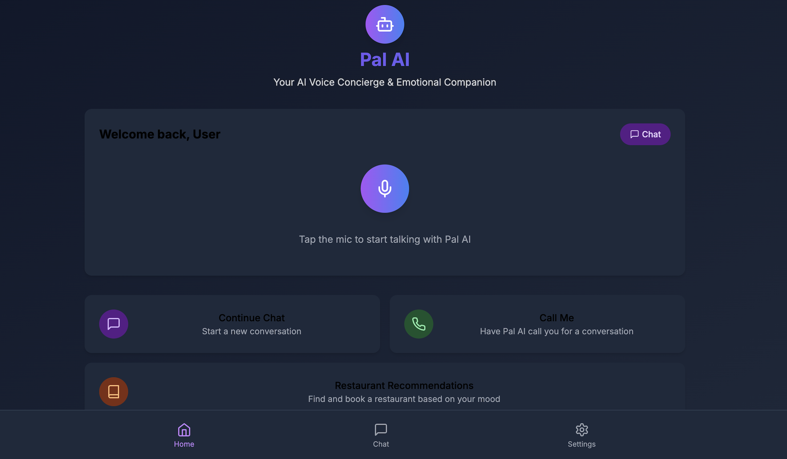

# Pal AI - Voice Concierge & Emotional Companion

Pal AI is an emotionally intelligent voice concierge that learns from user behavior, recommends food, handles bookings, and provides companionship through voice calls. It combines task-oriented AI with natural conversation and memory to create a truly human experience.



## Features

- 🎯 Multi-modal interaction (voice, text, calls)
- 🧠 Emotional intelligence with mood adaptation
- 🍽️ Restaurant recommendations and bookings
- 📞 Voice call companion feature
- 🔐 Secure authentication (Google & Email)
- 💾 Persistent memory and preferences
- 🎨 Mood-responsive UI design

## Tech Stack

- **Frontend**: React + Vite + TypeScript
- **Styling**: Tailwind CSS
- **Auth**: Supabase Authentication
- **Database**: Supabase
- **AI**: Google Gemini API
- **Voice**: Twilio (coming soon)
- **State Management**: React Context
- **Routing**: React Router
- **Icons**: Lucide React

## Getting Started

1. Clone the repository
2. Install dependencies:
   ```bash
   npm install
   ```
3. Set up environment variables:
   ```bash
   cp .env.example .env
   ```
   Fill in your:
   - Supabase credentials
   - Google Gemini API key
   - Twilio credentials (when implemented)

4. Start the development server:
   ```bash
   npm run dev
   ```

## Environment Variables

```env
VITE_SUPABASE_URL=your_supabase_url
VITE_SUPABASE_ANON_KEY=your_supabase_anon_key
VITE_GEMINI_API_KEY=your_gemini_api_key
VITE_TWILIO_ACCOUNT_SID=your_twilio_sid
VITE_TWILIO_AUTH_TOKEN=your_twilio_auth_token
```

## Project Structure

```
src/
├── components/        # Reusable UI components
├── context/          # React Context providers
├── hooks/            # Custom React hooks
├── lib/              # Utility functions and API clients
├── pages/            # Route components
├── styles/           # Global styles and Tailwind config
└── types/            # TypeScript type definitions
```

## Authentication Flow

1. Users can sign in with:
   - Google OAuth
   - Email/Password
   - Phone Number (for voice features)

2. Phone verification is required for voice call features
3. User preferences and settings are stored in Supabase

## AI Integration

- Uses Google's Gemini API for natural language processing
- Contextual understanding and emotional intelligence
- Memory system for personalized interactions
- Multi-modal capabilities for future expansion

## Voice Integration (Coming Soon)

- Twilio integration for real voice calls
- Voice synthesis and recognition
- Real-time conversation capabilities
- Emotional tone detection and adaptation

## Contributing

1. Fork the repository
2. Create a feature branch
3. Commit your changes
4. Push to the branch
5. Open a Pull Request

## License

MIT License - feel free to use this project for learning or building your own AI companion!